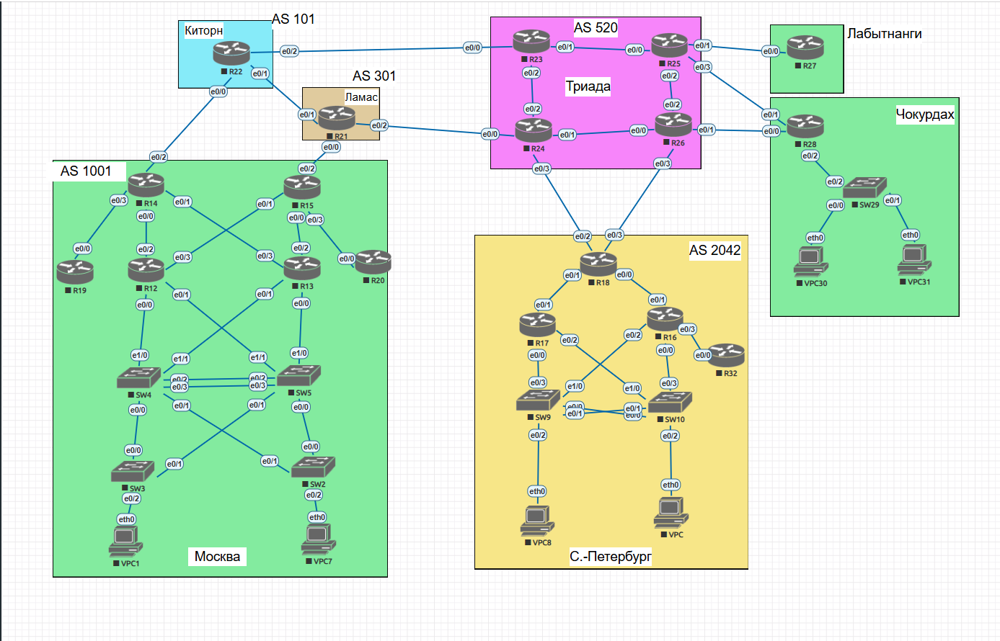

# Лабораторная работа №1 — Архитектура сети

## 🎯 Цель работы
Разработать и настроить архитектуру распределенной корпоративной сети с несколькими офисами.

## 📊 Топология сети


### AS (Автономные системы)
| AS | Название | Описание |
|----|----------|----------|
| 520 | Триада | Интернет-провайдер |
| 101 | Ламас | Интернет-провайдер |
| 301 | Киторн | Интернет-провайдер |
| 1001 | Москва | Офисный сегмент |
| 2042 | С-Петербург, Чокурдах | Офисный сегмент |

## ✅ Выполненные задачи

### 1. Адресное пространство
- Разработана иерархическая схема адресации
- Каждому офису выделен свой блок
- P2P-линки используют /30 подсети
- Loopback интерфейсы используют /32
- Подробнее: [addressing.md](addressing.md)

### 2. Настройка IP-адресов
- Настроены все интерфейсы маршрутизаторов
- Настроены VLAN на коммутаторах
- Настроены VPC в соответствующих VLAN
- Конфиги: [config/](config/)

### 3. VLAN и управление
- Каждый офис имеет свою VLAN-схему
- Настроены управляющие VLAN (999)
- Loopback интерфейсы для управления
- Подробнее: [vlans/vlan_mapping.md](vlans/vlan_mapping.md)

### 4. Защита от broadcast-штормов
- Используется Rapid PVST+ для каждого VLAN
- Root-мосты выбраны оптимально
- Настроен BPDU Guard на access-портах
- Подробнее: [SPAN_TREE.md](SPAN_TREE.md)

## 🛠 Используемые технологии

### Маршрутизация
- **OSPF** — внутри офисов (Area 0)
- **BGP** — между офисами и провайдерами

### Коммутация
- **VLAN** — изоляция трафика
- **Rapid PVST+** — защита от петель
- **Port Security** — защита портов

## 📝 Документация
- [Адресное пространство](addressing.md)
- [VLAN Mapping](vlans/vlan_mapping.md)
- [Настройка STP](SPAN_TREE.md)
- [Конфигурации устройств](config/)

## 🔧 Проверка связности
```bash
# Пинг внутри офиса Москва
VPC1> ping 10.77.1.100

# Пинг между офисами
R12# ping 10.78.1.100

# Проверка BGP соседей
R14# show ip bgp summary

## 🔧 Проверка связности
```bash
# Пинг внутри офиса Москва
VPC1> ping 10.77.1.100

# Пинг между офисами
R12# ping 10.78.1.100

# Проверка BGP соседей
R14# show ip bgp summary


---

### 📄 2. addressing.md (полный адресный план)

```bash
cat > HomeLabs/Lab01/addressing.md << 'EOF'
# Адресное пространство лабораторного стенда

## 🔢 Принципы нумерации
- Loopback — /32
- P2P-линки между маршрутизаторами — /30
- Пользовательские VLAN — /24 или /25
- Управляющие VLAN — /28 или /29

---

## 🌐 Интернет-провайдер Триада (AS 520)

| Устройство | Порт | Подсеть | Описание |
|------------|------|---------|----------|
| **R23** | e0/0 | 100.0.0.0/30 | R23 to R22 |
| | e0/1 | 10.0.0.4/30 | R23 to R25 |
| | e0/2 | 10.0.0.0/30 | R23 to R24 |
| | lo0 | 100.0.0.251/32 | Loopback |
| **R24** | e0/0 | 100.0.0.4/30 | R24 to R21 |
| | e0/1 | 10.0.0.8/30 | R24 to R26 |
| | e0/2 | 10.0.0.0/30 | R24 to R23 |
| | e0/3 | 100.0.0.8/30 | R24 to R18 |
| | lo0 | 100.0.0.252/32 | Loopback |
| **R25** | e0/0 | 10.0.0.4/30 | R25 to R23 |
| | e0/1 | 100.0.0.16/30 | R25 to R27 |
| | e0/2 | 10.0.0.12/30 | R25 to R26 |
| | e0/3 | 100.0.0.12/30 | R25 to R28 |
| | lo0 | 100.0.0.253/32 | Loopback |
| **R26** | e0/0 | 10.0.0.8/30 | R26 to R24 |
| | e0/1 | 100.0.0.24/30 | R26 to R28 |
| | e0/2 | 10.0.0.12/30 | R26 to R25 |
| | e0/3 | 100.0.0.20/30 | R26 to R18 |
| | lo0 | 100.0.0.254/32 | Loopback |

---

## 🌐 Интернет-провайдер Ламас (AS 101)

| Устройство | Порт | Подсеть | Описание |
|------------|------|---------|----------|
| **R21** | e0/0 | 100.77.0.4/30 | R21 to R15 |
| | e0/1 | 100.77.0.0/30 | R21 to R22 |
| | e0/2 | 100.0.0.4/30 | R21 to R24 |
| | lo0 | 100.77.0.254/32 | Loopback |

---

## 🌐 Интернет-провайдер Киторн (AS 301)

| Устройство | Порт | Подсеть | Описание |
|------------|------|---------|----------|
| **R22** | e0/0 | 100.78.0.0/30 | R22 to R14 |
| | e0/1 | 100.77.0.0/30 | R22 to R21 |
| | e0/2 | 100.0.0.0/30 | R22 to R23 |
| | lo0 | 100.78.0.254/32 | Loopback |

---

## 🏢 Офис Москва (AS 1001, блок 10.77.0.0/16)

### Маршрутизаторы
| Устройство | Порт | Подсеть | Описание |
|------------|------|---------|----------|
| **R14** | e0/0 | 10.77.0.4/30 | R14 to R12 |
| | e0/1 | 10.77.0.8/30 | R14 to R13 |
| | e0/2 | 100.78.0.0/30 | R14 to R22 |
| | e0/3 | 10.77.0.0/30 | R14 to R19 |
| | lo0 | 10.77.0.254/32 | Loopback |
| **R15** | e0/0 | 10.77.0.16/30 | R15 to R13 |
| | e0/1 | 10.77.0.12/30 | R15 to R12 |
| | e0/2 | 100.77.0.4/30 | R15 to R21 |
| | e0/3 | 10.77.0.20/30 | R15 to R20 |
| | lo0 | 10.77.0.253/32 | Loopback |
| **R19** | e0/0 | 10.77.0.0/30 | R19 to R14 |
| | lo0 | 10.77.0.252/32 | Loopback |
| **R12** | e0/0 | 10.77.0.24/30 | R12 to SW4 |
| | e0/1 | 10.77.0.28/30 | R12 to SW5 |
| | e0/2 | 10.77.0.4/30 | R12 to R14 |
| | e0/3 | 10.77.0.12/30 | R12 to R15 |
| | lo0 | 10.77.0.251/32 | Loopback |
| **R13** | e0/0 | 10.77.0.36/30 | R13 to SW5 |
| | e0/1 | 10.77.0.32/30 | R13 to SW4 |
| | e0/2 | 10.77.0.16/30 | R13 to R15 |
| | e0/3 | 10.77.0.8/30 | R13 to R14 |
| | lo0 | 10.77.0.250/32 | Loopback |
| **R20** | e0/0 | 10.77.0.20/30 | R20 to R15 |
| | lo0 | 10.77.0.249/30 | Loopback |

### Коммутаторы и VLAN
| Устройство | Интерфейс/VLAN | Подсеть | Описание |
|------------|----------------|---------|----------|
| **SW4** | e1/0 | 10.77.0.24/30 | SW4 to R12 |
| | e1/1 | 10.77.0.32/30 | SW4 to R13 |
| | VLAN 10 | 10.77.1.0/25 | Клиенты VLAN 10 |
| | VLAN 20 | 10.77.1.128/25 | Клиенты VLAN 20 |
| | VLAN 999 | 10.77.0.224/28 | Management |
| | lo0 | 10.77.0.248/32 | Loopback |
| **SW5** | e1/0 | 10.77.0.36/30 | SW5 to R13 |
| | e1/1 | 10.77.0.28/30 | SW5 to R12 |
| | VLAN 10 | 10.77.1.0/25 | Клиенты VLAN 10 |
| | VLAN 20 | 10.77.1.128/25 | Клиенты VLAN 20 |
| | VLAN 999 | 10.77.0.224/28 | Management |
| | lo0 | 10.77.0.247/32 | Loopback |
| **SW3** | lo0 | 10.77.0.228/28 | Loopback |
| **SW2** | lo0 | 10.77.0.229/28 | Loopback |

### VPC
| Устройство | VLAN | IP-адрес | Шлюз |
|------------|------|----------|------|
| VPC1 | 10 | 10.77.1.0/25 | 10.77.1.1 |
| VPC7 | 20 | 10.77.1.128/25 | 10.77.1.129 |

---

## 🏢 Офис Санкт-Петербург (AS 2042, блок 10.78.0.0/16)

### Маршрутизаторы
| Устройство | Порт | Подсеть | Описание |
|------------|------|---------|----------|
| **R18** | e0/0 | 10.78.0.0/30 | R18 to R16 |
| | e0/1 | 10.78.0.24/30 | R18 to R17 |
| | e0/2 | 100.0.0.8/30 | R18 to R24 |
| | e0/3 | 100.0.0.20/30 | R18 to R26 |
| | lo0 | 10.78.0.254/32 | Loopback |
| **R17** | e0/0 | 10.78.0.20/30 | R17 to SW9 |
| | e0/1 | 10.78.0.24/30 | R17 to R18 |
| | e0/2 | 10.78.0.16/30 | R17 to SW10 |
| | lo0 | 10.78.0.253/32 | Loopback |
| **R16** | e0/0 | 10.78.0.8/30 | R16 to SW10 |
| | e0/1 | 10.78.0.0/30 | R16 to R18 |
| | e0/2 | 10.78.0.12/30 | R16 to SW9 |
| | e0/3 | 10.78.0.4/30 | R16 to R32 |
| | lo0 | 10.78.0.252/32 | Loopback |
| **R32** | e0/0 | 10.78.0.4/30 | R32 to R16 |
| | lo0 | 10.78.0.251/32 | Loopback |

### Коммутаторы и VLAN
| Устройство | Интерфейс/VLAN | Подсеть | Описание |
|------------|----------------|---------|----------|
| **SW9** | e0/3 | 10.78.0.20/30 | SW9 to R17 |
| | e1/0 | 10.78.0.12/30 | SW9 to R16 |
| | VLAN 30 | 10.78.1.0/24 | Клиенты VLAN 30 |
| | lo0 | 10.78.0.250/32 | Loopback |
| **SW10** | e0/3 | 10.78.0.8/30 | SW10 to R16 |
| | e1/0 | 10.78.0.16/30 | SW10 to R17 |
| | VLAN 30 | 10.78.1.0/24 | Клиенты VLAN 30 |
| | lo0 | 10.78.0.249/32 | Loopback |

### VPC
| Устройство | VLAN | IP-адрес | Шлюз |
|------------|------|----------|------|
| VPC8 | 30 | 10.78.1.0/24 | 10.78.1.1 |
| VPC0 | 30 | 10.78.1.0/24 | 10.78.1.1 |

---

## 🏢 Офис Чокурдах (AS 2042, блок 10.67.0.0/16)

| Устройство | Порт/VLAN | Подсеть | Описание |
|------------|-----------|---------|----------|
| **R28** | e0/0 | 100.0.0.24/30 | R28 to R26 |
| | e0/1 | 100.0.0.12/30 | R28 to R25 |
| | e0/2.100 | 10.67.1.0/25 | VLAN 100 |
| | e0/2.200 | 10.67.1.128/25 | VLAN 200 |
| | e0/2.999 | 10.67.0.0/29 | VLAN 999 |
| | lo0 | 10.67.0.254/32 | Loopback |
| **SW29** | lo0 | 10.67.0.2/29 | VLAN 999 |

### VPC
| Устройство | VLAN | IP-адрес | Шлюз |
|------------|------|----------|------|
| VPC30 | 100 | 10.67.1.0/25 | 10.67.1.1 |
| VPC31 | 200 | 10.67.1.128/25 | 10.67.1.129 |

---

## 🏢 Офис Лабытнанги (блок 10.68.0.0/16)

| Устройство | Порт | Подсеть | Описание |
|------------|------|---------|----------|
| **R27** | e0/0 | 100.0.0.16/30 | R27 to R25 |
| | lo0 | 10.68.0.254/32 | Loopback |

---

## 📊 Сводная таблица AS

| Офис/Провайдер | AS | IP-блок |
|----------------|-----|---------|
| Триада | 520 | 100.0.0.0/24, 10.0.0.0/24 |
| Ламас | 101 | 100.77.0.0/24 |
| Киторн | 301 | 100.78.0.0/24 |
| Москва | 1001 | 10.77.0.0/16 |
| Санкт-Петербург | 2042 | 10.78.0.0/16 |
| Чокурдах | 2042 | 10.67.0.0/16 |
| Лабытнанги | - | 10.68.0.0/16 |
